# Join work with

.pull-left[

## Methods 

* M. Du Roy De Chaumaray,
* S. El Koleil,
* P. Gloaguen,  
* S. Le Corff, 
* M. Marbac-Lourdelle
* A. Martin,
* T. Michelot, 
* J. Olsson,

]

.pull-right[

## Applications

* M. Authier,
* T. Hoch,
* N. Morellet,
* S. Mahévas,
* R. Patin,
* E. Rivot.
]
---
name: intro

<!-- F1D763 -->
<!-- F7A913 -->
<!-- C94326 -->
<!-- 1F908E -->
<!-- 33658A -->


```{r setup, include = FALSE,  eval = TRUE}
library('RefManageR')
main_dir <-  '..'
common_img_dir <- file.path(main_dir,'courses_tools','resources', 'common_figs')
course_img_dir <- file.path(main_dir,'resources', 'figs')
BibOptions(check.entries = FALSE,
           bib.style = "authoryear",
           cite.style = "authoryear",
           style = "markdown",
           hyperlink = TRUE,
           max.names = 3,
           longnamesfirst= FALSE, 
           dashed = TRUE)
myBib <- ReadBib('biblio_soutenance.bib', check = FALSE)
```

```{r xaringan-fit-screen, echo=FALSE}
xaringanExtra::use_fit_screen()
```

<!-- # Why do I enjoy research in statistics  ? -->
<!-- -- -->


<!-- <div class= "addspace"> -->
<!-- <li> Working with researchers from different background,</li> -->
<!-- </div> -->

<!-- <div class= "addspace"> -->
<!-- <li> Never left the school system, </li> -->
<!-- </div> -->


<!-- <div class= "addspace"> -->
<!-- <li> Continnuously learning new concepts, methods, tools  </li> -->
<!-- </div> -->

<!-- <div class= "addspace"> -->
<!-- <li> being confortable with my inside geek part.  </li> -->
<!-- </div> -->


# Movement ecology paradigm


##  `r Citep(myBib, 'nathan2008movement')` presents individual movement as the results of

.pull-left[
<figure>
  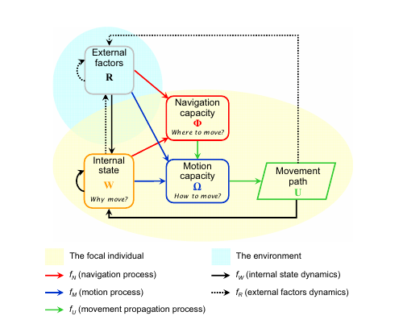
</figure>
.legend[  Movement drivers by `r Citet(myBib, "nathan2008movement")` ]
]

.pull-right[

* Motion capacities
* Internal state
* Environment
]
  
--

.question[Movement informs on internal states and habitat preferences]

---
name: move2data
# From Movement to Movement data


--


.pull-left[
<figure>
  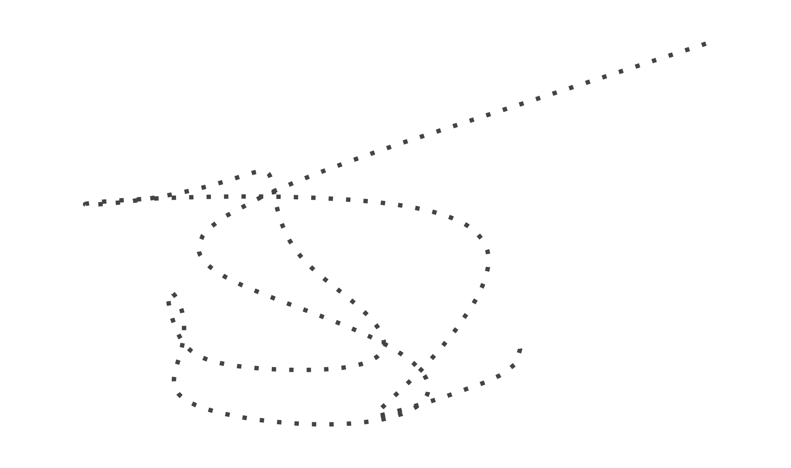
</figure>
]

---
template: move2data
count: false


.pull-left[
<figure>
  
</figure>
]


---
template: move2data
count: false


.pull-left[
<figure>
  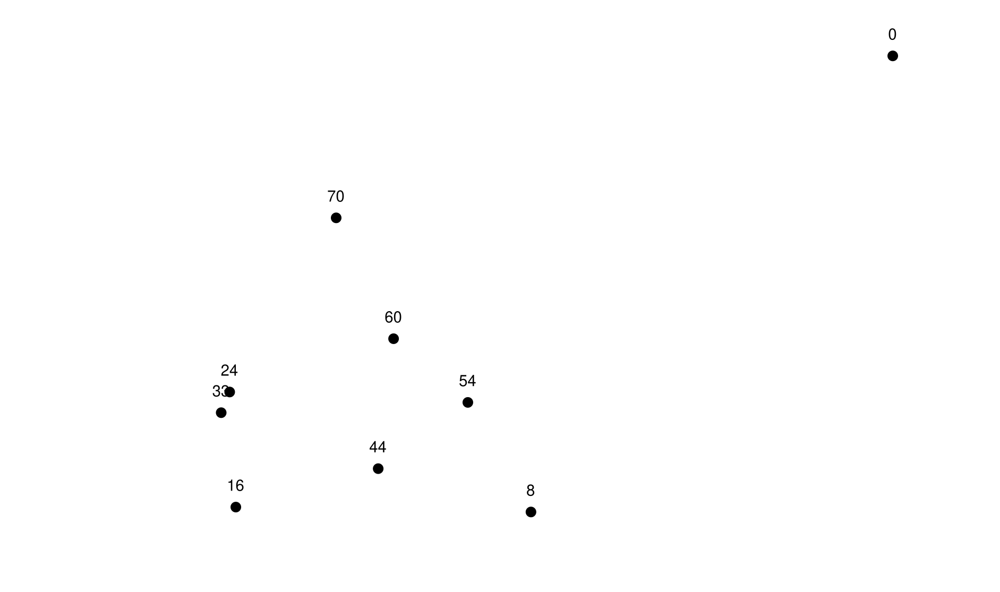
</figure>
]

---
template: move2data
count: false


.pull-left[
<figure>
  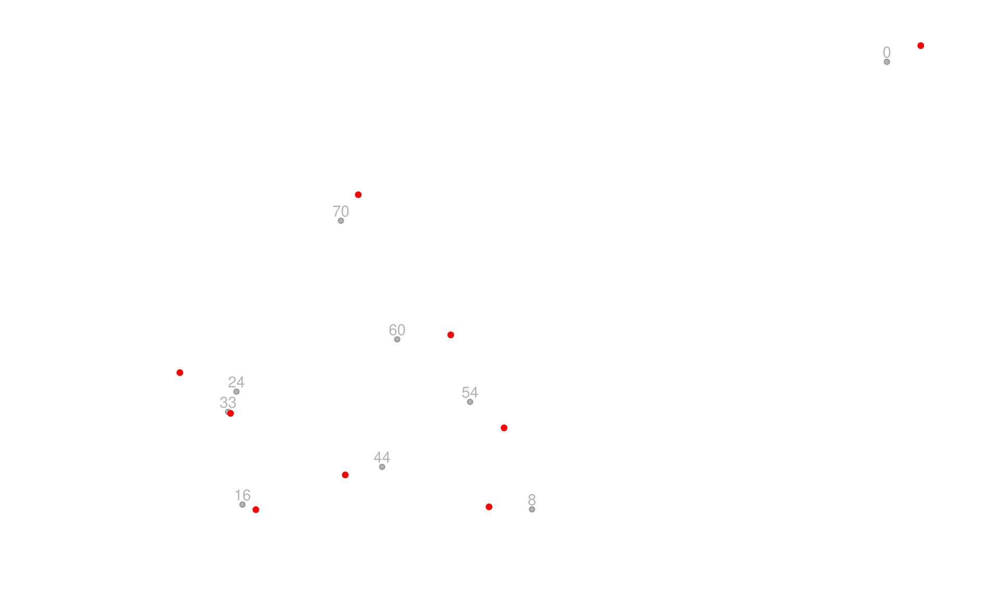
</figure>
]

--

.pull-right[
A continuous process sampled at some discrete potentially irregular times.

Time series with values in $\mathbb{R}^2$ (on earth ...).

$$\begin{array}\\ 
 \mbox{Time} & \mbox{Location} & \mbox{Turning angle} & \mbox{Speed}\\
t_{0} & (x_0, y_0) & NA & NA\\
t_{1} & (x_1, y_1) & NA & sp_1\\
t_{2} & (x_2, y_2) & ang_2 & sp_2\\
\vdots & \vdots& \vdots& \vdots \\
t_{n} & (x_n, y_n) & ang_n & sp_n\\\\
\end{array}$$
]


---
# Ecological questions 

  

.pull-left[

## Behavioural ecology

<figure>
  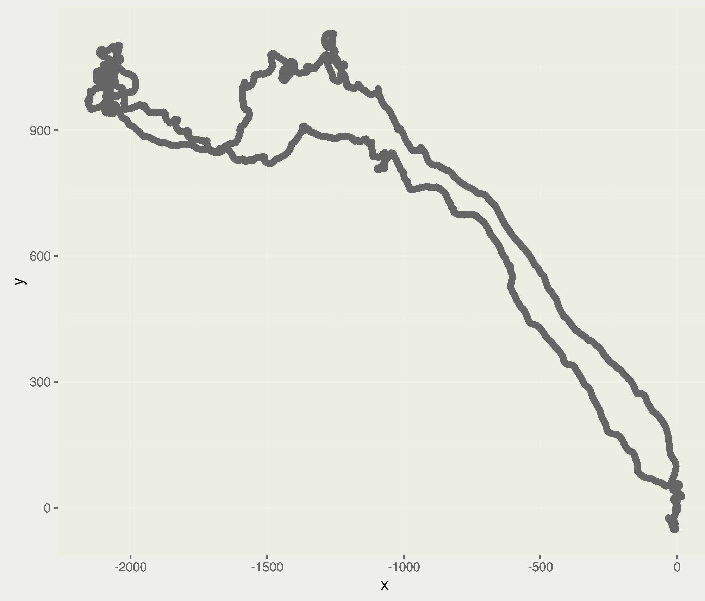
.legend[Peruvian booby  data courtesy of Sophie Bertrand]
</figure>
]


---
# Ecological questions 


.pull-left[

## Behavioural ecology  

<figure>
  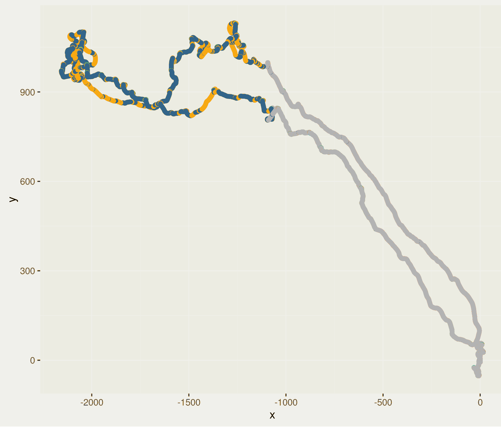
.legend[Peruvian booby  data courtesy of Sophie Bertrand]
</figure>
]

--

.pull-right[

## Habitat preference 

<figure>
  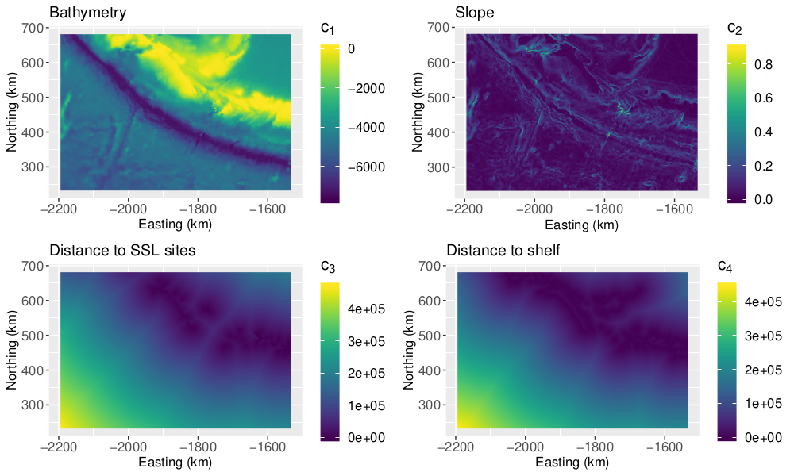
.legend[Sea Lions habitat description]
</figure>
]


---
name: data2model
# From Movement Data to Movement Model

--

Often analysed using discrete time model  `r Citep(myBib, "mcclintock2014discrete")`

--

<figure>
  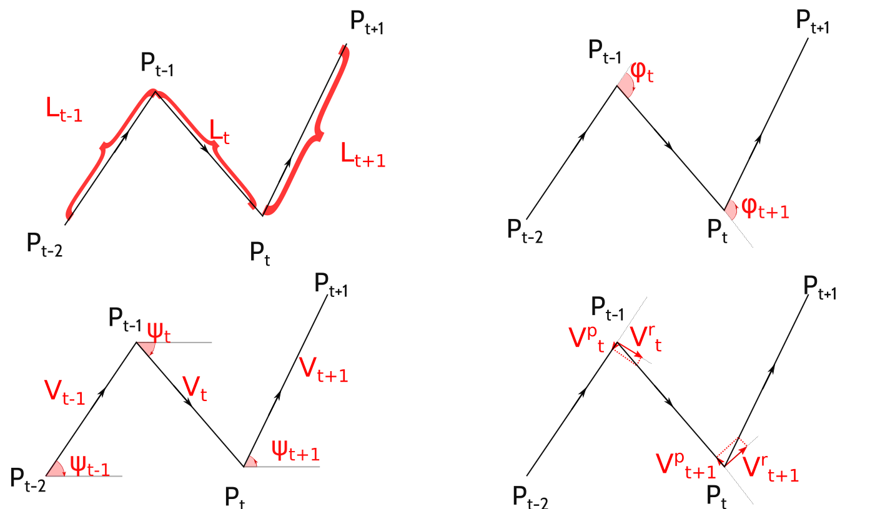
.legend[Movement decomposition]
</figure>


---
name:signal

# Signal processing methods 
--

##  Heterogeneity in movement pattern interpretated as different internal states

.pull-left[
<figure>
  
.legend[Peruvian booby  data courtesy of Sophie Bertrand]
</figure>
]

.pull-right[
## Accounting for internal states

 * Change point detection approach. `r Citep(myBib, "patin2019identifying")` based on `r Citep(myBib, "picard2007segmentation")`

 * More classically addressed with Hidden Markov Model `r Citep(myBib, c("morales2004extracting", "walker2010pioneer", "gurarie2009novel", "michelot2016movehmm"))`
]

$$Y_k \vert S_{k} = i \overset{i.i.d}{\sim} \mathcal{L}(\theta_i),$$
$$S_0 \sim \nu_0, \quad \mathbb{P}(S_k =j \vert S_k = i) = \pi_{ij}$$
--

In `r Citep(myBib, c( "michelot2016movehmm"))`, 

$$\mathbb{P}(S_k =j \vert S_k = i, Cov_{i}) \propto \exp \left \lbrace \beta Cov_i \right \rbrace$$


---
template: signal

### Choosing the number of hidden states

* Typically using likelihood based criteria  AIC, BIC ICL 


.question[`r Citep(myBib, "pohle2017selecting")` advocate that likelihood based criteria tend to overestimate the number of components and this number should be chosen according to biological considerations.]


The main suspect : the strong parametric form of the emission model in classical HMM model in ecology 

--

A new hope: new non parametric approaches have been proposed `r Citep(myBib, "lehericy2019consistent", "dechaumaray2022estimation")`


--

.question[Movement path is more than time series, importance of considering the space.]


.center[.care[Proposing ecologically meaningful movement models]]

Pros and cons of  Discrete time versus continuous time movement models  discussed in `r Citet(myBib, 'mcclintock2014discrete')` 

---

# Potential based Diffusions as continuous time movement model 

Let  $(X_s)_{s\geq0}\in\mathbb{R}^2$ denote the position at time $s$.

.pull-left[
* Brownian motion: a pure diffusion model
$$dX_s = dW_s, \quad X_0=x_0.$$
<figure>
  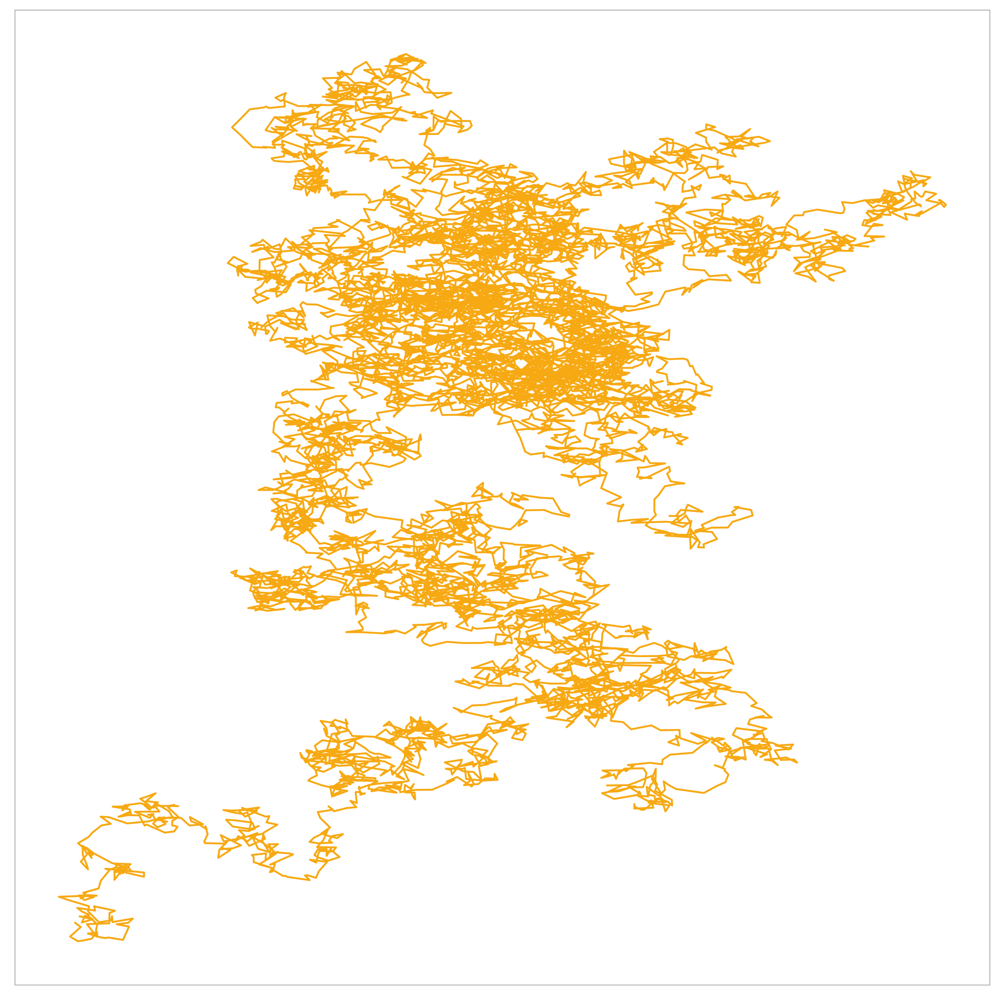
</figure>
]

--
.pull-left[
* Ornstein Uhlenbeck process: central place behavior
$$dX_s = -B (X_s- \mu) ds + dW_s, \quad X_0=x_0.$$

<figure>
  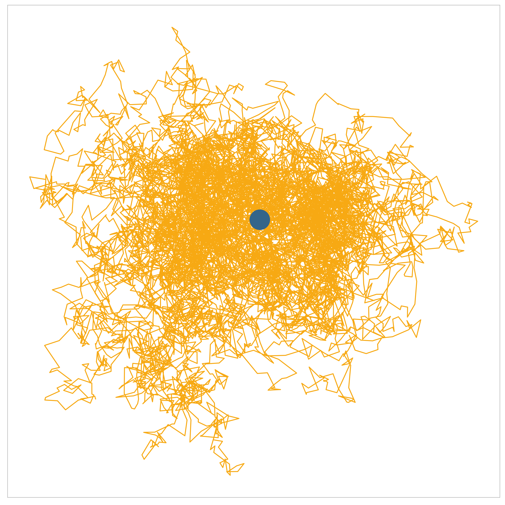
</figure>
]


Popular models as  Brownian Motion and Ornstein Uhlenbeck have known transition densities 
$q(x_t, x_{t+s})$ which is not the case in general.

---


# Potential based Diffusions as continuous time movement model 

`r Citet(myBib,'brillinger2002employing')` propose a flexible framework
$$dX_s = -\nabla H_{\theta}(X_s) ds + \gamma dW_s, \quad X_0=x_0.$$

but no explicit transitions $q_{\theta}(x_t, x_{t+s})$

--

In `r Citet(myBib,'Gloaguen2018stochastic')`, as part  of *P. Gloaguen's PhD*, explore $H_{\theta}(X_s) = \sum_{k=1}^K \pi_k \varphi_k(X_s),$

.pull-left[
<figure>
  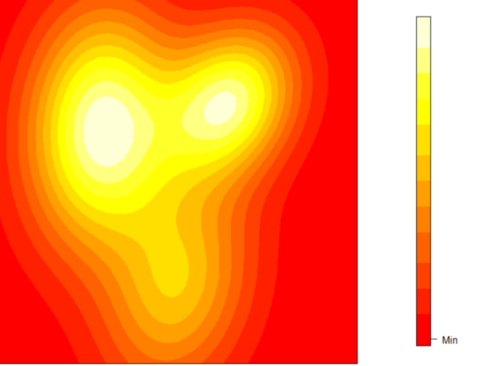
</figure>
]

--

.pull-right[
* Euler approximation : biased estimates with low frequency data
* `r Citep(myBib, 'ozaki1992bridge')` and `r Citet(myBib,'kessler1997estimation')` same results than
* MCEM based on exact simulation `r Citep(myBib, 'beskos2006exact')` limits the flexibility of the SDE.
]


---


---

# Potential based Diffusions as continuous time movement model 

## Flexible movement model for habitat preference

<figure>
  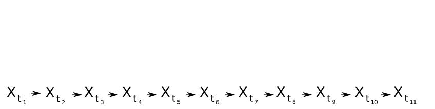
</figure>


---

# Potential based Diffusions as continuous time movement model 

## Flexible movement model for habitat preference


<figure>
  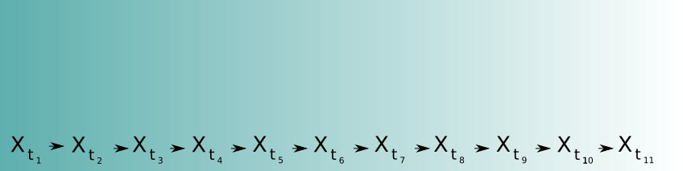
   .legend[Flexible movement model which accounts for environment]
</figure>


<!-- --- -->
<!-- template: movement -->
<!-- ## Flexible movement model -->

<!-- <figure> -->
<!--   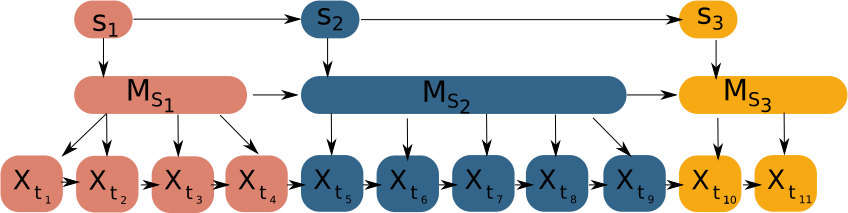 -->
<!--    <figcaption> Flexible non homogeneous movement model</figcaption> -->
<!-- </figure> -->


---

# Potential based Diffusions as continuous time movement model 

## Flexible movement model for habitat preference

A classical choice of **resource selection function**, (i.e stationary distribution including covariates)
$$\pi{\left(x \vert \theta\right)} \varpropto  \exp\left(\sum_{j=1}^J \theta_j c_j (x) \right). $$ 

Diffusion, under regularity condition admits a stationary  distribution.  

--

Combining the ideas of `r Citep(myBib, "michelot2019linking")`, and  `r Citep(myBib, "brillinger2002employing")` lead to the Langevin diffusion as movement model, 
$$
	d X_t = \frac{\gamma^2}{2} \nabla \log \pi_{\theta}{\left(X_t\right)} \, d t + \gamma \,d W_t,\quad X_0 =x_0.
$$
--

Using Euler approximation 

$$	X_{i+1} \vert \lbrace X_i = x_i \rbrace = 
    	x_i + \frac{\gamma^2 \Delta_i}{2} \sum_{j=1}^J \theta_j \nabla c_j(x_i) + \sqrt{\Delta_i}  \varepsilon_{i+1},\quad 
    	\varepsilon_{i+1} \overset{ind}{\sim} N \left( {0} , \gamma^2 \boldsymbol{I}_d \right),$$

leads to a simple linear model published in `r Citet(myBib,"michelot2019langevin")`.
    	
    	
    	
---

# Potential based Diffusions as continuous time movement model 

## Flexible movement model for habitat preference


.pull-left[
<figure>
  
.legend[Sea Lions habitat description]
</figure>
]

--

.pull-right[

<figure>
  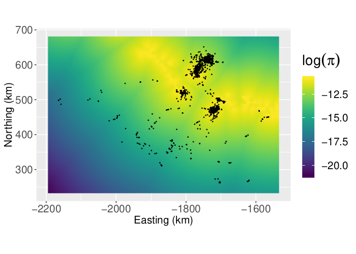
.legend[Sea Lions habitat description]
</figure>
]

--

.small[ On going work on Sea birds in the Mediteranean sea and Roe deer next to Toulouse]

---
name: POD
# Potential based Diffusions as continuous time movement model 


## Partially observed SDE 
.pull-left[
  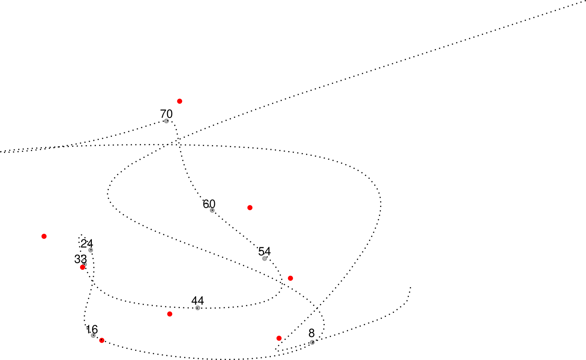
]


.pull-right[

Let  $Y_k$ be the recorded position $s_k$, a noisy observation of the true position $X_k$:

$$dX_s = b_{\theta}(X_s) ds + \gamma dW_s, \quad X_0=x_0;$$
$$Y_k \overset{ind}{\sim} g_{\theta_o} (X_k).$$
]

--

<figure>
  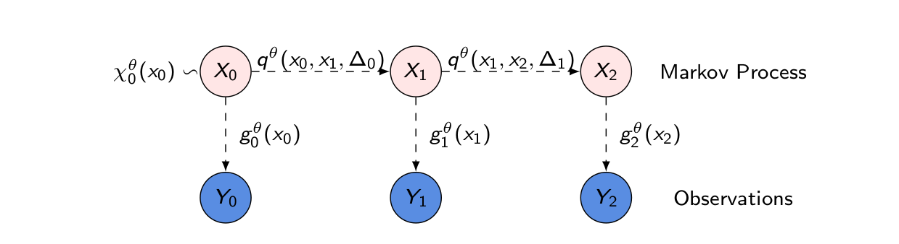
.legend[DAG representation]
</figure>


---
template:POD

### Estimation key quantity : additive smoothing distributions in E Step

$$\sum_{k=0}^{n-1}\mathbb{E}( h(X_k, X_{k+1}) \vert Y_{0:n})$$
---
name: POD2
# Potential based Diffusions as continuous time movement model 


## Sequential method for fltering distribution : $\mathbb{E}( M(X_k) \vert Y_{0:k})$.

--
<figure>
  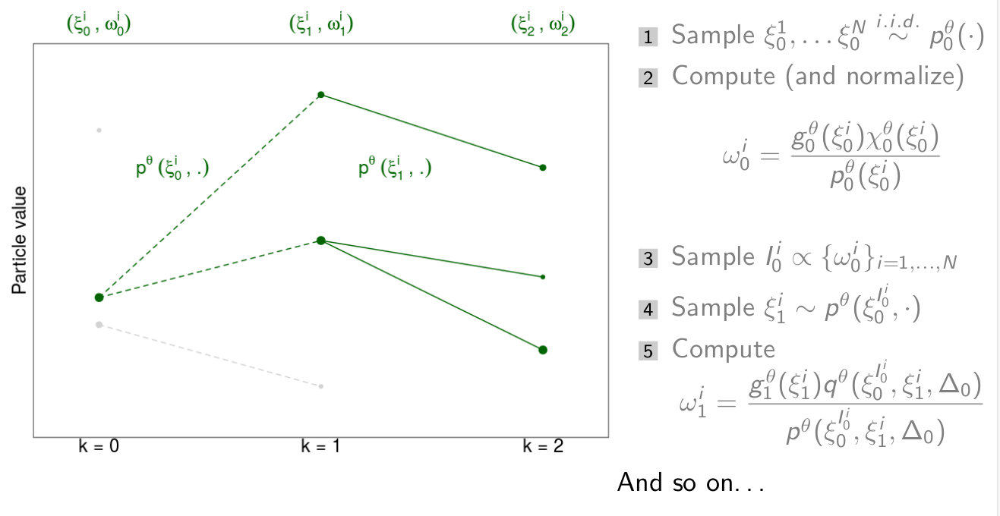
.legend[Particle Filter]
</figure>

---
template: POD2

###  The problem with POD processes

* $q^\theta(x, y, \Delta)$ can't be computed (even when $\theta$ is known);
* This quantity is crucial for weights computation.

--

### General Poisson estimator ( `r Citet(myBib, "fearnhead2008particle")` )

Under some assumptions, there exists an unbiased estimator $\class{\orange}{\hat{q}^\theta(x_k,x_{k+1},\Delta_k,\zeta_k)}$ such that 

$$\class{\orange}{\hat{q}^\theta(x_k,x_{k+1},\Delta_k,\zeta_k)}>0\text{ and } \mathbb{E}[\class{orange}{\hat{q}^\theta(x_k,x_{k+1},\Delta_k,\zeta_k)}] =q^\theta(x_k,x_{k+1},\Delta_k)$$

$\class{orange}{\zeta_k}$ is a random variable requiring simulation of constrained Brownian bridges.
--

 
### New filtering weights
${\omega_k^i=\frac{g_1^\theta(\xi_k^i)q^\theta(\xi_{k-1}^{I_{k}^i},\xi_k^i, \Delta_{k-1})}{p^\theta(\xi_{k-1}^{I_{k-1}^i},\xi_k^i, \Delta_{k-1})}}$ is replaced by $\class{orange}{\hat{\omega}_k^i}=\frac{g_1^\theta(\xi_k^i)\class{orange}{\hat{q}^\theta(\xi_{k-1}^{I_{k}^i},\xi_k^i, \Delta_{k-1}, \zeta_{k-1})}}{p^\theta(\xi_{k-1}^{I_{k-1}^i},\xi_k^i, \Delta_{k-1})}$ 

---
name: POD3
# Potential based Diffusions as continuous time movement model 


## Sequential method for smoothing distribution : $\mathbb{E}( h(X_k, X_{k+1} ) \vert Y_{0:k})$.

--

<figure>
  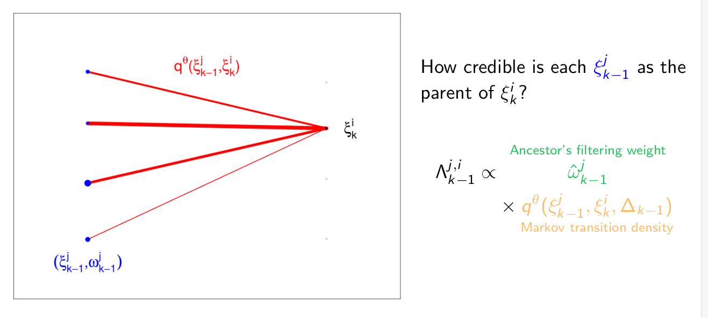
.legend[Particle Filter]
</figure>

---
template: POD3


### Main problem
Backward smoothing requires to sample an ancestor (value of $j$) with weights:
$${\Lambda_{k-1}^{j,i}}= \frac{{\hat{\omega}_{k-1}^j}q^\theta(\xi_{k-1}^j,\xi_k^i, \Delta_{k-1})}
{\sum_{\ell=1}^N {\hat{\omega}_{k-1}^\ell} q^\theta(\xi_{k-1}^\ell,\xi_k^i, \Delta_{k-1})}.$$

The probability of $\xi_{k-1}^j$ being the ancestor of $\xi_{k}^i$ under the true dynamics

--

### The solution? (When $q^\theta$ can't be computed) 
Use the unbiased estimator $\class{orange}{\hat{q}^\theta(\xi_{k-1}^{j},\xi_k^i, \Delta_{k-1}, \zeta_i)}$ as a substitute:
$${\hat{\Lambda}_{k-1}^{j,i}}= \frac{\hat{\omega}_{k-1}^j\class{orange}{\hat{q}^\theta(\xi_{k-1}^{j},\xi_k^i, \Delta_{k-1}, \zeta_i)}}{\sum_{\ell=1}^N \hat{\omega}_{k-1}^\ell \class{orange}{\hat{q}^\theta(\xi_{k-1}^{j},\xi_k^i, \Delta_{k-1}, \zeta_i)}}$$

But  $\mathbb{E}({\hat{\Lambda}_{k-1}^{j,i}}) \ne {\Lambda}_{k-1}^{j,i},$ because of the ratio.

---
template: POD3

## The final strategy 

* The particle-based, rapid incremental smoother (PaRIS)  algorithm `r Citep(myBib, "olsson2017efficient")` provides  an online smoother using a rewriting of the Backward weight and an acceptation/rejection mechanism but depends on $q(\xi_{k-1}, \xi_{k})$

* The generalized random PaRIS algorithm, in  `r Citep(myBib, "gloaguen2018online")`, samples using an AR algorithm to avoid the normalisation step  and  an importance sampling approach in `r Citep(myBib, "martin2023backward")`

---
template: POD3

A Predator - Prey Lokta Volterra model

.pull-left[

<figure>
  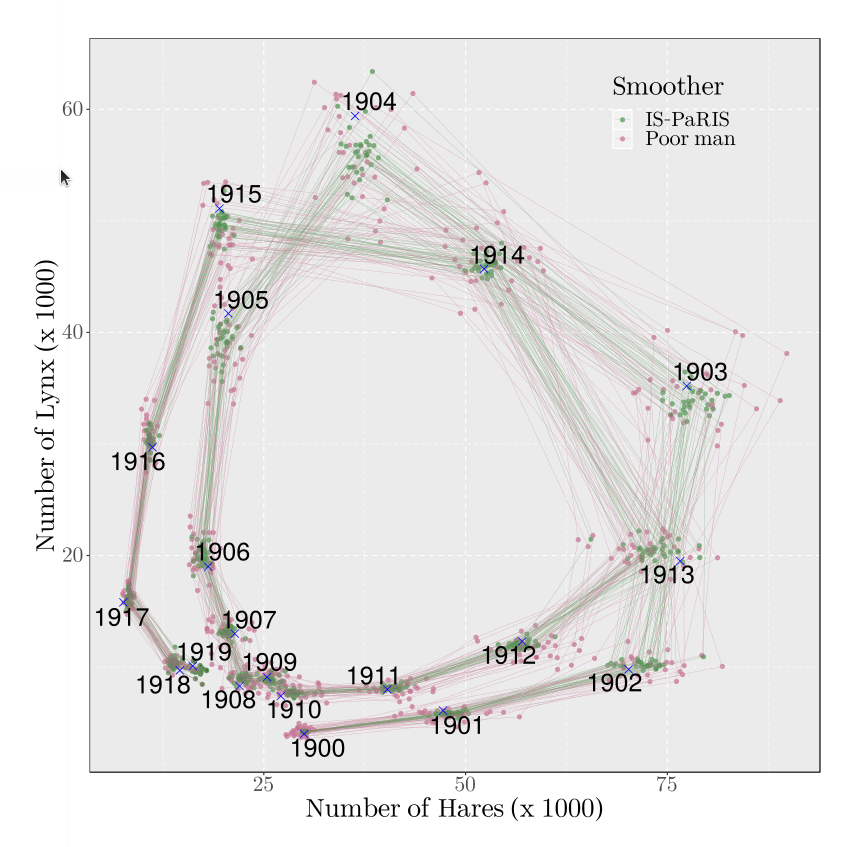
.legend[Smoothing distribution for a POD Lokta Volterra]
</figure>
]

--

.pull-right[
.question[Requires a nuclear Power plant to run!]

]
---

# On going work

### Some natural extension of the Langevin model useful in movement ecology

* Coupling Hidden Markov model or change point detection model with a Langevin distribution:
<figure>
  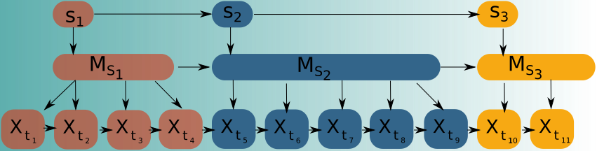
</figure>

* Change the Langevin model for an hypoellitptic approach
$$d X_t = V_t dt; X_0 =x_0.$$

$$d V_t = - \nabla \log \pi{\left(X_t\right)} \, d t  -\frac{\nu^2}{2} V_t + \nu \,d W_t,\quad $$

---
# Perspectives 

### Some natural extension of the Langevin model useful in movement ecology

* Introduction of an individual random effect,

###  Handling categorical covariates
`r Citet(myBib, "lejay2018maximum")` define a threshold diffusion and proposes an ML estimation method. Explore the generalisation to $\mathbb{R}^2$. 

### Longer term perspective
* Collective movement: Cheaper GPS imply  massive deployment. Invest the area of collective movement analysis.
* Combined with sound monitoring

### Going away from Markovian model ???


---
# A few words to finish


* Close interaction with biologist,
  - it's helpful,
  - provides exciting statistical problems,
  - experiment a large diversity of approaches.
* Hidden variables approach
  - provide flexible models (spatial abundance, classification in time series, Partially observed SDE)
  - popularized in Ecology in a Bayesian setting but frequentist approach is also possible
* The Markovian property
  - not so realistic,
  - but a key component in both theoretical approach and computational aspects


---
class: biblio
# Bibliography


```{r refs, echo=FALSE, results="asis", eval = TRUE, cache = FALSE}
PrintBibliography(myBib, start = 1, end = 7)
```

---
class: biblio
count: false
# Bibliography


```{r refs_2, echo=FALSE, results="asis", eval = TRUE, cache = FALSE}
PrintBibliography(myBib, start = 8, end = 14)
```


---
class: biblio
count: false
# Bibliography


```{r refs_3, echo=FALSE, results="asis", eval = TRUE, cache = FALSE}
PrintBibliography(myBib, start = 15, end = 16)
```

